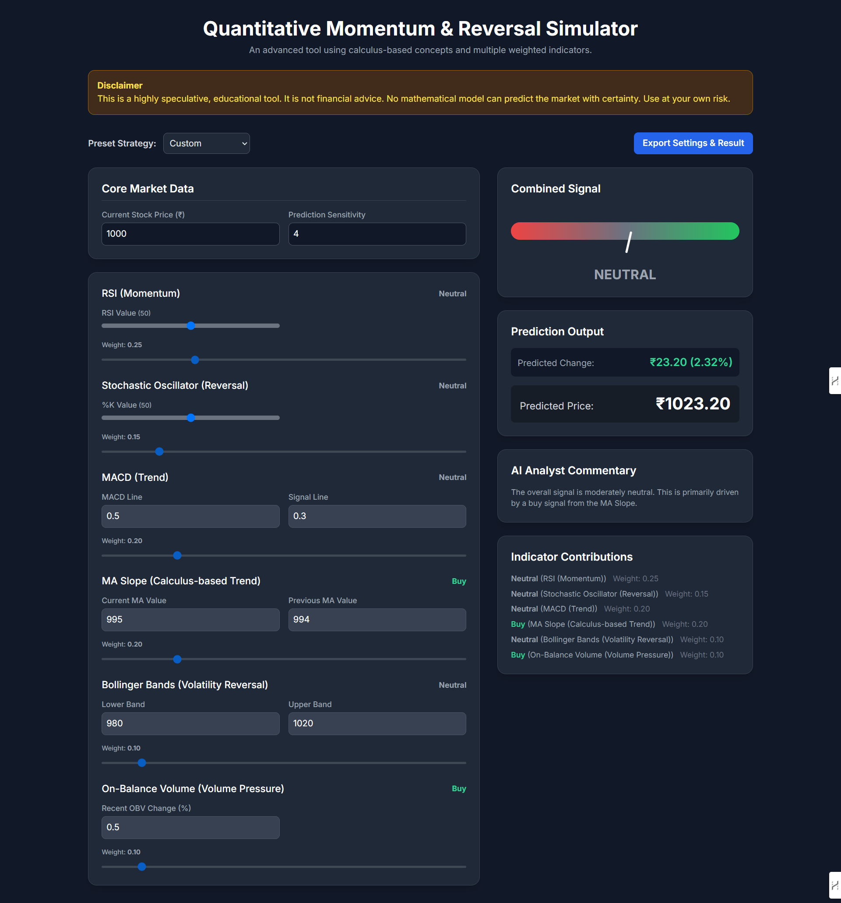

# AI Financial Analysis Simulator

A modern, interactive, and educational dashboard for simulating stock market strategies. This tool integrates Google's Gemini AI to analyze market news, interpret chart images, and provide real-time, human-like analysis alongside traditional technical indicators.

**Built with a Python (Flask) backend, a multimodal Gemini AI integration, and a beautiful TailwindCSS-powered frontend.**

---

## 🚀 Features

- **🧠 AI Smart Analyst:**
    - Paste any financial news article to get an instant AI-generated analysis.
    - The AI determines the sentiment, implied strategy, and automatically sets the indicator weights on the platform for you.
- **📈 Multimodal Chart Analysis:**
    - Upload one or more chart images for the AI to analyze.
    - The AI identifies key chart patterns, support/resistance levels, and candlestick formations to provide a comprehensive technical analysis.
- **🤖 FinBot Assistant:**
    - An integrated chatbot trained on the platform's features and general financial concepts.
    - Ask for trading insights or help on how to use the simulator.
- **📊 Multiple Technical Indicators:**
    - Utilizes RSI, Stochastic, MACD, MA Slope, Bollinger Bands, and OBV.
    - Each indicator shows its own real-time signal (e.g., Strong Buy, Neutral, Sell).
- **🎛️ Fully Customizable Strategy:**
    - Manually adjust the weight and input values for every indicator to test your own hypotheses.
    - Choose from preset strategies like Momentum, Mean Reversion, or Balanced.
- **Export/Save:** Download your settings and results as a JSON file
- **Modern & Interactive UI:**
    - A responsive, dark-mode dashboard with a live signal gauge and dynamic controls.
    - Export your complete setup and results to a JSON file with a single click.
- **No real money or live trading – for educational/demo use only**

---

# 🖥️ Live Demo & Screenshot

[](https://kanhaiya1610.github.io/Stock-Price-Predictor/)
---

## 🛠️ Setup Guide

### 1. **Clone the Repository**
```sh
git clone https://github.com/Kanhaiya1610/Stock-Price-Predictor.git
cd Stock-Price-Predictor
```

### 2. **Install Python Dependencies**
- Make sure you have Python 3.8+ and pip installed. It's highly recommended to use a virtual environment.
```sh
# Create and activate a virtual environment (optional but recommended)
python -m venv venv
source venv/bin/activate  # On Windows, use `venv\Scripts\activate`

# Install required packages
pip install -r requirements.txt
```
### 3. **Set Up Your Gemini API Key**
- This project requires a Google Gemini API key to function.
- Get your key from Google AI Studio.
- In the stock_price.py file, find this line:
```sh
genai.configure(api_key="YOUR_API_KEY")
```
- Replace "YOUR_API_KEY" with your actual key.

### 4. **Run the Flask Server**
```sh
python stock_price.py
```
- By default, the app runs at [http://127.0.0.1:5000/](http://127.0.0.1:5000/)

### 5. **Open the Dashboard**
- Open your browser and go to [http://127.0.0.1:5000/](http://127.0.0.1:5000/)

---

## 📋 User Manual

### **Dashboard Sections**

- **Core Market Data:**  
  - Enter the current stock price and adjust prediction sensitivity.
    
- **Smart Analyst:**
  - Paste news text and/or upload chart images.
  - Click "Analyze & Set Strategy" for the AI to provide advice and auto-configure the indicator weights.
    
- **FinBot Assistant:**  
  - Click the chat bubble at the bottom right.
  - Ask for trading insights or questions about the platform (e.g., "What does RSI mean?").
    
- **Indicators:**  
  - Adjust values and weights for RSI, Stochastic, MACD, MA Slope, Bollinger Bands, and OBV.
    
- **Combined Signal Gauge:**  
  - Visual needle shows the overall market signal based on your settings.

- **Prediction Output:**  
  - See the predicted price change (₹ and %) and the final predicted price.

- **AI Analyst Commentary:**  
  - A plain-English explanation of the prediction, which is now generated after every change to the indicator settings.
- **Indicator Contributions:**  
  - See how much each indicator is contributing to the final signal.

- **Export/Save:**  
  - Click "Export Settings & Result" to download your current setup and prediction as a JSON file.

---

## 🤝 Contributing

Pull requests are welcome! For major changes, please open an issue first to discuss what you would like to change or add.

---

## 🐞 Issues

If you find a bug or want to request a feature, please open an [issue](https://github.com/Kanhaiya1610/Stock-Price-Predictor/issues).

---

## 📄 License

This project is licensed under the MIT License.

---

## ⚠️ Disclaimer

This tool is for educational and illustrative purposes only and does not constitute financial advice. AI models can make mistakes. Always do your own research and consult with a professional. Use at your own risk.

--- 
